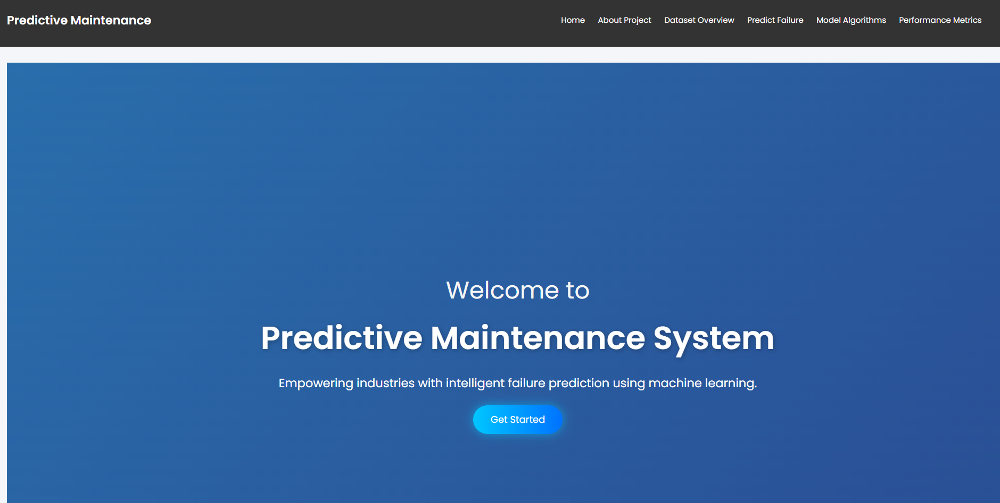
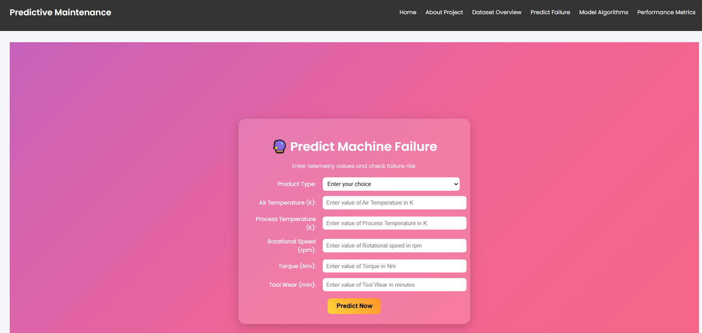
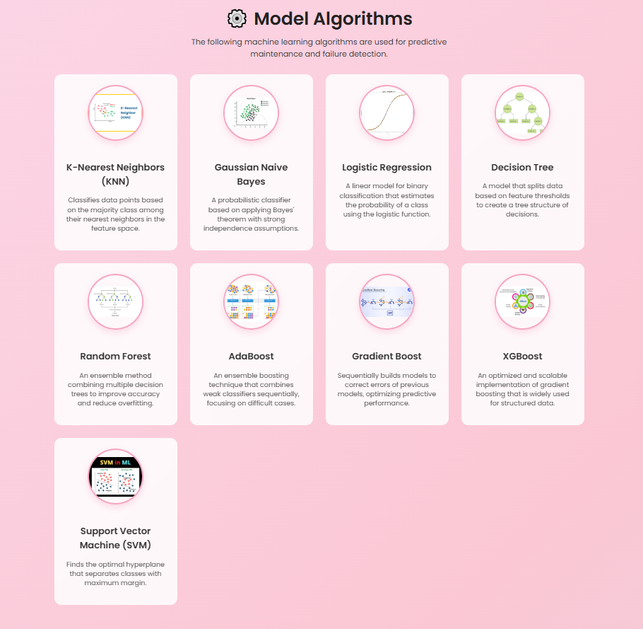
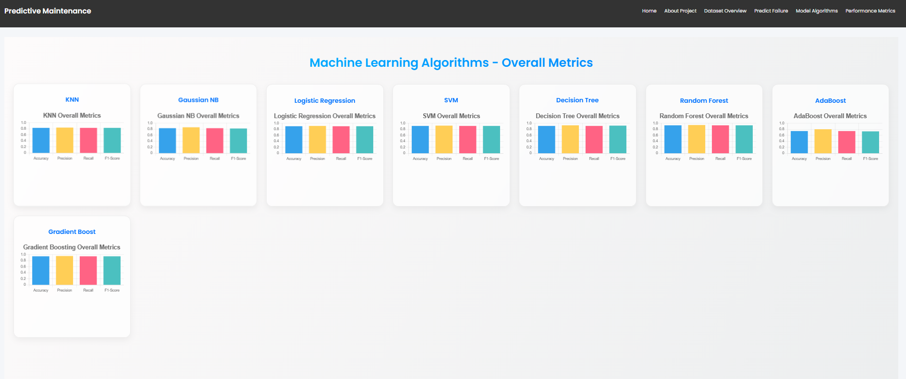

# 🔧 Predictive Maintenance System

A full-stack machine learning web application that predicts machine failures based on sensor data using a Random Forest Classifier.

---

## 📌 Project Overview

This project uses real-world industrial sensor data to predict whether a machine is likely to fail, and identifies the type of failure. It combines a React frontend, Node.js backend, and a Python Flask ML API.

---

## 🗂️ Project Structure

```
mini_project/
├── client/                              # React Frontend + Python ML API
│   ├── src/
│   │   ├── pages/                       # All React pages
│   │   ├── components/                  # Navbar and shared components
│   │   ├── app.js
│   │   └── index.js
│   ├── public/                          # Static assets (images)
│   ├── app.py                           # Flask ML API
│   ├── train.py                         # Model training script
│   ├── model_pipeline.joblib            # Trained ML model
│   ├── requirements.txt                 # Python dependencies
│   └── package.json                     # React dependencies
│
├── server/                              # Node.js Express Backend
│   ├── controllers/
│   ├── models/
│   ├── routes/
│   ├── app.js
│   └── package.json
│
├── screenshots/                         # Project screenshots
├── cleaned_predictive_maintenance.csv   # Dataset (10,000 records)
└── README.md
```

---

## 📊 Dataset

- **Records:** 10,000 machine sensor readings
- **Features:** Product ID, Type (L/M/H), Air Temperature, Process Temperature, Rotational Speed, Torque, Tool Wear
- **Target:** Machine Failure (0 or 1)
- **Failure Types:** Heat Dissipation, Overstrain, Power Failure, Tool Wear, Random Failures

---

## 🤖 ML Models Used

- Random Forest Classifier ✅ (Primary)
- Decision Tree
- KNN
- Logistic Regression
- SVM
- Gradient Boosting
- AdaBoost
- Gaussian Naive Bayes

---

## 🛠️ Tech Stack

| Layer | Technology |
|-------|-----------|
| Frontend | React.js |
| Backend | Node.js + Express |
| ML API | Python + Flask |
| ML Library | Scikit-learn |
| Data Processing | Pandas, NumPy |

---

## 📸 Screenshots

### 🏠 Home Page


### 🔍 Input Field (Prediction)


### 🤖 Model Algorithms


### 📊 Overall Metrics


---

## 🚀 How to Run

### Prerequisites
- Node.js (v18+)
- Python (v3.10+)
- Git

---

### Step 1 — Clone the repository
```bash
git clone https://github.com/AkhilKadunuri/Predictive-Maintenance-.git
cd Predictive-Maintenance-
```

### Step 2 — Run the Backend (CMD 1)
```bash
cd server
npm install
node app.js
```
Server runs on **http://localhost:5000**

### Step 3 — Run the Python ML API (CMD 2)
```bash
cd client
pip install -r requirements.txt
python app.py
```
Flask API runs on **http://127.0.0.1:5000**

### Step 4 — Run the Frontend (CMD 3)
```bash
cd client
npm install
npm start
```
React app opens on **http://localhost:3000**

---

## 👨‍💻 Author

**Akhil Kadunuri**
- GitHub: [@AkhilKadunuri](https://github.com/AkhilKadunuri)

---

## 📄 License

This project is for educational purposes as part of a mini project.
